# Alfashop E-Commerce

## 📖 Descripción

Alfashop es una plataforma en línea que permite a los usuarios explorar un catálogo de productos con descripciones, imágenes y precios, agregar artículos a un carrito de compras, y realizar pagos de manera segura mediante diversas opciones, como tarjetas de crédito. Además, ofrece funcionalidades como registro de usuarios y historial de compras.

## 🎯 Propósito

El propósito de Alfashop es facilitar la compra y venta de productos o servicios de manera rápida, accesible y segura, brindando a los usuarios una experiencia eficiente que les permita adquirir lo que necesitan desde cualquier lugar, mientras las empresas amplían su alcance y optimizan sus procesos de ventas.

## 📋 Características Principales

- **Catálogo de Productos**: Listado organizado con imágenes, descripciones detalladas, precios.
- **Carrito de Compras**: Herramienta para seleccionar, gestionar y calcular el costo total de los productos antes de la compra.
- **Pasarela de Pago**: Integración de métodos de pago seguros.
- **Gestión de Usuarios**: Opciones de registro, inicio de sesión y acceso al historial de compras.
- **Seguridad**: Protección de datos personales.

## 🛠️ Tecnologías utilizadas

- Spring Security con JWT
- MySQL
- JPA como ORM
- Pruebas Unitarias Mockito
  - Reporte de Pruebas Unitarias con InteliJ
- Mocha y Cypress
  - Reporte de Pruebas con Mochawesome
- SonarQube
- Jenkins pipeline

## 📜 Estructura del proyecto

```
Alfashop/
├───.scannerwork
│   ├───.sonar_lock
│   └───report-task.txt
├───back
│   ├───.mvn
│   │   └───wrapper
│   │       └───maven-wrapper.properties
│   ├───src
│   │   ├──main
│   │   │  ├──java
│   │   │  │     └──com
│   │   │  │        └──pe
│   │   │  │    	└──unmsm
│   │   │  │    	    └──fisi
│   │   │  │    		└──alfashop
│   │   │  │    		    ├──controller
│   │   │  │    		    │   ├──PagoController.java
│   │   │  │    		    │   ├──PedidoController.java
│   │   │  │    		    │   ├──ProductoController.java
│   │   │  │    		    │   ├──ResenaController.java
│   │   │  │    		    │   └──UsuarioController.java
│   │   │  │    		    ├──infrastructure
│   │   │  │    		    │   ├──DTO
│   │   │  │    		    │   │   ├──PagoRequest.java
│   │   │  │    		    │   │   ├──PagoResponse.java
│   │   │  │    		    │   │   ├──PedidoRequest.java
│   │   │  │    		    │   │   ├──PedidoResponse.java
│   │   │  │    		    │   │   ├──ProductCatResponse.java
│   │   │  │    		    │   │   ├──ProductoCompraRequest.java
│   │   │  │    		    │   │   ├──ProductReponse.java
│   │   │  │    		    │   │   ├──ResenaRequest.java
│   │   │  │    		    │   │   └──ResenaResponse.java
│   │   │  │    		    │   ├──mapper
│   │   │  │    		    │   │   ├──PagoMapper.java
│   │   │  │    		    │   │   ├──PedidoMapper.java
│   │   │  │    		    │   │   ├──ProductoMapper.java
│   │   │  │    		    │   │   └──ResenaMapper.java
│   │   │  │    		    │   └──repository
│   │   │  │    		    │       ├──CategoriaRepository.java
│   │   │  │    		    │       ├──PagoRepository.java
│   │   │  │    		    │       ├──PedidoProductoRepository.java
│   │   │  │    		    │       ├──PedidoRepository.java
│   │   │  │    		    │       ├──ProductoRepository.java
│   │   │  │    		    │       ├──ResenaRepository.java
│   │   │  │    		    │       └──UsuarioRepository.java
│   │   │  │    		    ├──model
│   │   │  │    		    │   ├──Categoria.java
│   │   │  │    		    │   ├──MetodoPago.java
│   │   │  │    		    │   ├──Pago.java
│   │   │  │    		    │   ├──Pedido.java
│   │   │  │    		    │   ├──PedidoProducto.java
│   │   │  │    		    │   ├──Producto.java
│   │   │  │    		    │   ├──Resena.java
│   │   │  │    		    │   ├──Rol.java
│   │   │  │    		    │   └──Usuario.java
│   │   │  │    		    ├──security
│   │   │  │    		    │   ├──config
│   │   │  │    		    │   │   └──SecurityConfig.java
│   │   │  │    		    │   ├──controller
│   │   │  │    		    │   │   └──AuthController.java
│   │   │  │    		    │   ├──DTO
│   │   │  │    		    │   │   ├──LoginRequest.java
│   │   │  │    		    │   │   ├──RegistroRequest.java
│   │   │  │    		    │   │   └──TokenResponse.java
│   │   │  │    		    │   ├──exception
│   │   │  │    		    │   │   └──UsuarioRegistradoException.java
│   │   │  │    		    │   ├──handler
│   │   │  │    		    │   │   ├──ErrorResponse.java
│   │   │  │    		    │   │   └──GlobalExceptionHandler.java
│   │   │  │    		    │   ├──jwt
│   │   │  │    		    │   │   ├──JwtFilter.java
│   │   │  │    		    │   │   └──JwtProvider.java
│   │   │  │    		    │   ├──repository
│   │   │  │    		    │   │   └──RolRepository.java
│   │   │  │    		    │   ├──service
│   │   │  │    		    │   │   └──UserDetailServicelmpl.java
│   │   │  │    		    │   └──RolEnum.java
│   │   │  │    		    ├──service
│   │   │  │    		    │   ├──PagoService.java
│   │   │  │    		    │   ├──PedidoService.java
│   │   │  │    		    │   ├──ProductoService.java
│   │   │  │    		    │   ├──ResenaService.java
│   │   │  │    		    │   └──UsuarioService.java
│   │   │  │    		    └──AlfashopApplication.java
│   │   │  │
│   │   │  └──resources
│   │   │        ├──alfashop v1.sql
│   │   │        ├──application.properties
│   │   │        └──backup.sql
│   │   └──test
│   │      └──java
│   │            └──com
│   │               └──pe
│   │           	└──unmsm
│   │           	    └──fisi
│   │           		└──alfashop
│   │   			    ├──service
│   │   			    │   ├──PagoServiceTest.java
│   │   			    │   ├──PedidoServiceTest.java
│   │   			    │   ├──ProductosServiceTest.java
│   │   			    │   ├──ResenaServiceTest.java
│   │   			    │   └──UsuarioServiceTest.java
│   │   			    └──AlfashopApplicationTest.java
│   ├──.gitignore
│   ├──docker-compose.yml
│   ├──Dockerfile
│   ├──mvnw
│   ├──mvnw.cmd
│   └──pom.xml
│
├───front
│   ├───cypress
│   │    ├──e2e
│   │    │    ├──addCartTest.cy.js
│   │    │    ├──buyTest.cy.js
│   │    │    ├──checkPaymentInfo.cy.js
│   │    │    ├──loginTest.cy.js
│   │    │    ├──manageCart.cy.js
│   │    │    └──registerTest.cy.js
│   │    ├──fictures
│   │    │    └──example.json
│   │    └──support
│   │         ├──commands.js
│   │         ├──commands.ts
│   │         ├──components.ts
│   │         ├──component-index.html
│   │         └──e2e.js
│   ├───public
│   │    ├──_redirects
│   │    └──vite.svg
│   ├───src
│   │    ├──assets
│   │    │    ├──images
│   │    │    │   └──resct.svg
│   │    │    └──styles
│   │    │        ├──App.css
│   │    │        ├──AppBar.css
│   │    │        ├──CustomerInfo.css
│   │    │        ├──Dashboard.css
│   │    │        ├──index.css
│   │    │        ├──PaymentInfo.css
│   │    │        └──Sidebar.css
│   │    ├──components
│   │    │    ├──Header.tsx
│   │    │    ├──Sidebar.tsx
│   │    │    └──SiderData.tsx
│   │    ├──config
│   │    │    ├──base.js
│   │    │    └──config.tsx
│   │    ├──models
│   │    │    ├──Cart.tsx
│   │    │    ├──Cartitem.tsx
│   │    │    ├──Order.tsx
│   │    │    ├──OrderLine.tsx
│   │    │    ├──OrderRequest.tsx
│   │    │    ├──PaymentHistory.tsx
│   │    │    ├──Product.tsx
│   │    │    ├──Review.tsx
│   │    │    └──User.tsx
│   │    ├──pages
│   │    │    ├──CartPage.tsx
│   │    │    ├──Categories.tsx
│   │    │    ├──CustomersInfo.tsx
│   │    │    ├──Dashboards.tsx
│   │    │    ├──Login.tsx
│   │    │    ├──LoginLogic.tsx
│   │    │    ├──LoginModal.tsx
│   │    │    ├──NotFound.tsx
│   │    │    ├──PaymentInfo.tsx
│   │    │    ├──ProdductDetails.tsx
│   │    │    ├──Products.tsx
│   │    │    ├──Pregister.tsx
│   │    │    ├──ReviewProduct.tsx
│   │    │    └──SimilarProducts.tsx
│   │    ├──App.tsx
│   │    ├──main.tsx
│   │    └──vite-env.d.ts
│   ├───.eslintrc.cjs
│   ├───.gitignore
│   ├───cypress.config.js
│   ├───index.html
│   ├───multi-reporter-config.json
│   ├───package.json
│   ├───package-lock.json
│   ├───README.md
│   ├───tsconfig.app.json
│   ├───tsconfig.json
│   ├───tsconfig.node.json
│   └───vite.config.ts
│
└───README.md
```

## 📊 Responsables

Proyecto desarrollado en Java Spring boot y React Vite (Typescript)

- Código de proyecto a ser analizado en SonarQube
- Grupo 7
- Alumnos:
  - Hidalgo Cock Joaquin
  - Rique Garcia Marko
  - Huaman Ortiz Emerson Raul
  - Landeo Cuentas Sebastian
  - Ore Paredes Gianfranco
  - Palomino Julian Alex Marcelo
- Curso: Verificación y Validación
- Profesor: Edgar Sarmiento Calisaya

# 📜 Jenkins Pipeline

Este pipeline está diseñado para automatizar el ciclo de vida de desarrollo de la aplicación **Alfashop**. Incluye pasos para la construcción, pruebas, análisis de calidad, empaquetado y despliegue.

## 🔧 Configuración de Herramientas

- **Git**
- **JDK**
- **Maven**
- **SonarQube Scanner**
- **Node.js**
- **Docker**
- **JMeter**
- **OWASP ZAP**
- **Cypress**

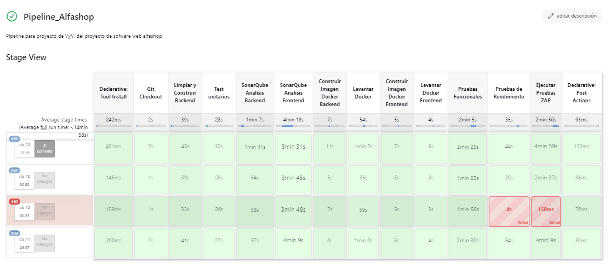

## 🛠️ Etapas del Pipeline

### 1. **Git Checkout**

Clona el repositorio desde la rama especificada.

```bash
stage("Git Checkout") {
    steps {
        checkout scmGit(branches: [[name: '*/jenkins']], extensions: [], userRemoteConfigs: [[credentialsId: 'GithubToken', url: 'https://github.com/JoaquinHC9/Alfashop2.0']])
    }
}
```

#### 1.1 Uso de Webhook

CI/CD por pipeline y disparado por eventos

Para habilitar la integración continua y disparar el pipeline por eventos en el repositorio, se hace uso de ngrok para exponer un servidor local a través de una dirección pública. Esto permite recibir notificaciones de eventos como push o pull_request en el sistema CI/CD.

Pasos para configurar ngrok:

1. Inicia tu servidor local
2. Asegurarse que la aplicación este en un puerto específico por ejemplo en jenkins, http://localhost:8081.
3. Ejecutar el siguiente comando

```bash
ngrok http 8081
```

4. Configura el webhook en el repositorio, ir a la configuración de Webhooks del repositorio. Añadir la url generado por ngrok a la sección donde dice Webhooks con la propiedad aplication/json

## 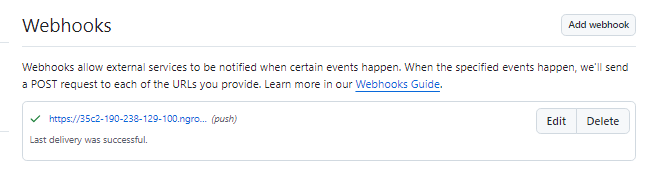

5. En Jenkins ir a configuracion -> Pipeline -> Pipeline syntax y escojer la opcion checkout: Checkout from version control.
6. Añadir el repositorio URL y las credenciales
   - Es recomendable generar un token en github, llendo a Settings -> Developer Options -> Personal Acces Tokens -> Tokens (Clasic)
7. Seleccionar la rama y añadir las opciones de include polling, y en settings del pipeline GITScm polling

### 2. **Construccion automatica (Limpiar y Construir Backend)**

Compila el proyecto backend utilizando Maven.

```bash
stage('Limpiar y Construir Backend') {
    steps {
        script {
            dir('back') {
                bat 'mvn clean install'
            }
        }
    }
}
```

Output

```
C:\Users\USER\.jenkins\workspace\Pipeline_Alfashop\back>mvn clean install
[INFO] Scanning for projects...
[INFO]
[INFO] ---------------------< com.pe.unmsm.fisi:alfashop >---------------------
[INFO] Building alfashop 1.0
[INFO]   from pom.xml
[INFO] --------------------------------[ jar ]---------------------------------
[INFO]
[INFO] --- clean:3.3.2:clean (default-clean) @ alfashop ---
[INFO] Deleting C:\Users\USER\.jenkins\workspace\Pipeline_Alfashop\back\target
[INFO]
[INFO] --- jacoco:0.8.7:prepare-agent (default) @ alfashop ---
[INFO] argLine set to -javaagent:C:\\Users\\USER\\.m2\\repository\\org\\jacoco\\org.jacoco.agent\\0.8.7\\org.jacoco.agent-0.8.7-runtime.jar=destfile=C:\\Users\\USER\\.jenkins\\workspace\\Pipeline_Alfashop\\back\\target\\jacoco.exec
[INFO]
[INFO] --- resources:3.3.1:resources (default-resources) @ alfashop ---
[INFO] Copying 2 resources from src\main\resources to target\classes
[INFO] Copying 2 resources from src\main\resources to target\classes
[INFO]
[INFO] --- compiler:3.8.1:compile (default-compile) @ alfashop ---
[INFO] Changes detected - recompiling the module!
[INFO] Compiling 54 source files to C:\Users\USER\.jenkins\workspace\Pipeline_Alfashop\back\target\classes
[INFO]
[INFO] --- resources:3.3.1:testResources (default-testResources) @ alfashop ---
[INFO] skip non existing resourceDirectory C:\Users\USER\.jenkins\workspace\Pipeline_Alfashop\back\src\test\resources
[INFO]
[INFO] --- compiler:3.8.1:testCompile (default-testCompile) @ alfashop ---
[INFO] Changes detected - recompiling the module!
[INFO] Compiling 14 source files to C:\Users\USER\.jenkins\workspace\Pipeline_Alfashop\back\target\test-classes
[INFO]
[INFO] --- surefire:3.2.5:test (default-test) @ alfashop ---
[INFO] Using auto detected provider org.apache.maven.surefire.junitplatform.JUnitPlatformProvider
[INFO]
[INFO] -------------------------------------------------------
[INFO]  T E S T S
[INFO] -------------------------------------------------------
[INFO] Running com.pe.unmsm.fisi.alfashop.AlfashopApplicationTests
10:20:15.210 [main] INFO org.springframework.test.context.support.AnnotationConfigContextLoaderUtils -- Could not detect default configuration classes for test class [com.pe.unmsm.fisi.alfashop.AlfashopApplicationTests]: AlfashopApplicationTests does not declare any static, non-private, non-final, nested classes annotated with @Configuration.
10:20:15.417 [main] INFO org.springframework.boot.test.context.SpringBootTestContextBootstrapper -- Found @SpringBootConfiguration com.pe.unmsm.fisi.alfashop.AlfashopApplication for test class com.pe.unmsm.fisi.alfashop.AlfashopApplicationTests
10:20:15.835 [main] INFO org.springframework.boot.devtools.restart.RestartApplicationListener -- Restart disabled due to context in which it is running

  .   ____          _            __ _ _
 /\\ / ___'_ __ _ _(_)_ __  __ _ \ \ \ \
( ( )\___ | '_ | '_| | '_ \/ _` | \ \ \ \
 \\/  ___)| |_)| | | | | || (_| |  ) ) ) )
  '  |____| .__|_| |_|_| |_\__, | / / / /
 =========|_|==============|___/=/_/_/_/

 :: Spring Boot ::                (v3.3.4)

2024-12-12T10:20:16.491-05:00  INFO 11900 --- [alfashop] [           main] c.p.u.f.a.AlfashopApplicationTests       : Starting AlfashopApplicationTests using Java 17.0.12 with PID 11900 (started by USER in C:\Users\USER\.jenkins\workspace\Pipeline_Alfashop\back)

[INFO] Results:
[INFO]
[INFO] Tests run: 59, Failures: 0, Errors: 0, Skipped: 0
[INFO]
[INFO]
[INFO] --- jar:3.4.2:jar (default-jar) @ alfashop ---
[INFO] Building jar: C:\Users\USER\.jenkins\workspace\Pipeline_Alfashop\back\target\alfashop-1.0.jar
[INFO]
[INFO] --- spring-boot:3.3.4:repackage (repackage) @ alfashop ---
[INFO] Replacing main artifact C:\Users\USER\.jenkins\workspace\Pipeline_Alfashop\back\target\alfashop-1.0.jar with repackaged archive, adding nested dependencies in BOOT-INF/.
[INFO] The original artifact has been renamed to C:\Users\USER\.jenkins\workspace\Pipeline_Alfashop\back\target\alfashop-1.0.jar.original
[INFO]
[INFO] --- spring-boot:3.3.4:repackage (default) @ alfashop ---
[INFO] Replacing main artifact C:\Users\USER\.jenkins\workspace\Pipeline_Alfashop\back\target\alfashop-1.0.jar with repackaged archive, adding nested dependencies in BOOT-INF/.
[INFO] The original artifact has been renamed to C:\Users\USER\.jenkins\workspace\Pipeline_Alfashop\back\target\alfashop-1.0.jar.original
[INFO]
[INFO] --- jacoco:0.8.7:report (default) @ alfashop ---
[INFO] Loading execution data file C:\Users\USER\.jenkins\workspace\Pipeline_Alfashop\back\target\jacoco.exec
[INFO] Analyzed bundle 'alfashop' with 25 classes
[INFO]
[INFO] --- install:3.1.3:install (default-install) @ alfashop ---
[INFO] Installing C:\Users\USER\.jenkins\workspace\Pipeline_Alfashop\back\pom.xml to C:\Users\USER\.m2\repository\com\pe\unmsm\fisi\alfashop\1.0\alfashop-1.0.pom
[INFO] Installing C:\Users\USER\.jenkins\workspace\Pipeline_Alfashop\back\target\alfashop-1.0.jar to C:\Users\USER\.m2\repository\com\pe\unmsm\fisi\alfashop\1.0\alfashop-1.0.jar
[INFO] ------------------------------------------------------------------------
[INFO] BUILD SUCCESS
[INFO] ------------------------------------------------------------------------
[INFO] Total time:  38.189 s
[INFO] Finished at: 2024-12-12T10:20:38-05:00
[INFO] ------------------------------------------------------------------------
```

---

### 3. **Test Unitarios**

Ejecuta pruebas unitarias en el backend.

```bash
stage('Test unitarios') {
    steps {
        script {
            dir('back') {
                bat 'mvn test'
            }
        }
    }
}
```

Resultado de Pruebas unitarias

```
024-12-12T10:21:55.494-05:00  INFO 7232 --- [alfashop] [           main] c.p.u.f.a.AlfashopApplicationTests       : Started AlfashopApplicationTests in 19.323 seconds (process running for 24.926)
Java HotSpot(TM) 64-Bit Server VM warning: Sharing is only supported for boot loader classes because bootstrap classpath has been appended
[INFO] Tests run: 1, Failures: 0, Errors: 0, Skipped: 0, Time elapsed: 23.15 s -- in com.pe.unmsm.fisi.alfashop.AlfashopApplicationTests
[INFO] Running com.pe.unmsm.fisi.alfashop.infrastructure.mapper.PagoMapperTest
[INFO] Tests run: 2, Failures: 0, Errors: 0, Skipped: 0, Time elapsed: 0.725 s -- in com.pe.unmsm.fisi.alfashop.infrastructure.mapper.PagoMapperTest
[INFO] Running com.pe.unmsm.fisi.alfashop.infrastructure.mapper.PedidoMapperTest
[INFO] Tests run: 2, Failures: 0, Errors: 0, Skipped: 0, Time elapsed: 0.033 s -- in com.pe.unmsm.fisi.alfashop.infrastructure.mapper.PedidoMapperTest
[INFO] Running com.pe.unmsm.fisi.alfashop.infrastructure.mapper.ProductoMapperTest
[INFO] Tests run: 2, Failures: 0, Errors: 0, Skipped: 0, Time elapsed: 0.342 s -- in com.pe.unmsm.fisi.alfashop.infrastructure.mapper.ProductoMapperTest
[INFO] Running com.pe.unmsm.fisi.alfashop.infrastructure.mapper.ResenaMapperTest
[INFO] Tests run: 2, Failures: 0, Errors: 0, Skipped: 0, Time elapsed: 0.026 s -- in com.pe.unmsm.fisi.alfashop.infrastructure.mapper.ResenaMapperTest
[INFO] Running com.pe.unmsm.fisi.alfashop.security.config.SecurityConfigTest
[INFO] Tests run: 4, Failures: 0, Errors: 0, Skipped: 0, Time elapsed: 1.439 s -- in com.pe.unmsm.fisi.alfashop.security.config.SecurityConfigTest
[INFO] Running com.pe.unmsm.fisi.alfashop.security.jwt.JwtFilterTest
[INFO] Tests run: 3, Failures: 0, Errors: 0, Skipped: 0, Time elapsed: 1.241 s -- in com.pe.unmsm.fisi.alfashop.security.jwt.JwtFilterTest
[INFO] Running com.pe.unmsm.fisi.alfashop.security.jwt.JwtProviderTest
[INFO] Tests run: 4, Failures: 0, Errors: 0, Skipped: 0, Time elapsed: 1.296 s -- in com.pe.unmsm.fisi.alfashop.security.jwt.JwtProviderTest
[INFO] Running com.pe.unmsm.fisi.alfashop.security.service.UserDetailServiceImplTest
[INFO] Tests run: 2, Failures: 0, Errors: 0, Skipped: 0, Time elapsed: 0.024 s -- in com.pe.unmsm.fisi.alfashop.security.service.UserDetailServiceImplTest
[INFO] Running com.pe.unmsm.fisi.alfashop.service.PagoServiceTest
[INFO] Tests run: 2, Failures: 0, Errors: 0, Skipped: 0, Time elapsed: 0.479 s -- in com.pe.unmsm.fisi.alfashop.service.PagoServiceTest
[INFO] Running com.pe.unmsm.fisi.alfashop.service.PedidoServiceTest
[INFO] Tests run: 6, Failures: 0, Errors: 0, Skipped: 0, Time elapsed: 0.602 s -- in com.pe.unmsm.fisi.alfashop.service.PedidoServiceTest
[INFO] Running com.pe.unmsm.fisi.alfashop.service.ProductoServiceTest
[INFO] Tests run: 6, Failures: 0, Errors: 0, Skipped: 0, Time elapsed: 0.188 s -- in com.pe.unmsm.fisi.alfashop.service.ProductoServiceTest
[INFO] Running com.pe.unmsm.fisi.alfashop.service.ResenaServiceTest
[INFO] Tests run: 11, Failures: 0, Errors: 0, Skipped: 0, Time elapsed: 0.375 s -- in com.pe.unmsm.fisi.alfashop.service.ResenaServiceTest
[INFO] Running com.pe.unmsm.fisi.alfashop.service.UsuarioServiceTest
[INFO] Tests run: 12, Failures: 0, Errors: 0, Skipped: 0, Time elapsed: 0.315 s -- in com.pe.unmsm.fisi.alfashop.service.UsuarioServiceTest
[INFO]
[INFO] Results:
[INFO]
[INFO] Tests run: 59, Failures: 0, Errors: 0, Skipped: 0
```

---

### 4. **SonarQube Análisis Backend**

Realiza un análisis estático del backend utilizando SonarQube.

```bash
stage("SonarQube Analisis Backend") {
    steps {
        script {
            dir('back') {
                bat "mvn clean verify sonar:sonar \
                -Dsonar.projectKey=AlfashopBackend \
                -Dsonar.projectName='AlfashopBackend' \
                -Dsonar.host.url=http://localhost:9000 \
                -Dsonar.token=${SONAR_TOKEN_BACK} \
                -Dsonar.language=java \
                -Dsonar.tests=src/test \
                -Dsonar.dynamicAnalysis=reuseReports \
                -Dsonar.junit.reportsPath=target/test-classes \
                -Dsonar.java.coveragePlugin=jacoco \
                -Dsonar.coverage.jacoco.xmlReportPaths=target/jacoco-report/jacoco.xml"
            }
        }
    }
}
```

Resultado de Análisis backend

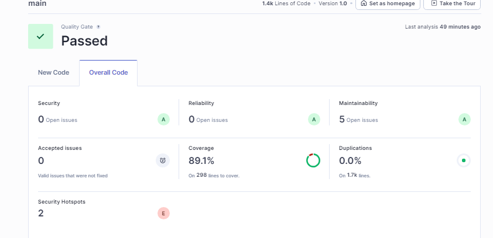

| **Métrica Evaluada**      | **Descripción**                                                                                                       | **Resultado**                |
| ------------------------- | --------------------------------------------------------------------------------------------------------------------- | ---------------------------- |
| **Seguridad**             | La calificación es **A** cuando no hay problemas de severidad mayor que "info" con impacto en la seguridad.           | **0** problemas abiertos.    |
| **Fiabilidad**            | La calificación es **A** cuando no hay problemas de severidad mayor que "info" con impacto en la fiabilidad.          | **0** problemas abiertos.    |
| **Mantenibilidad**        | La calificación es **A** si el código tiene un bajo nivel de deuda técnica en relación con el tamaño del código base. | **5** problemas abiertos.    |
| **Problemas aceptados**   | Problemas válidos que no se han corregido pero han sido aceptados.                                                    | **0**                        |
| **Cobertura**             | Porcentaje de líneas de código cubiertas por pruebas.                                                                 | **89.1%** en 298 líneas.     |
| **Duplicación**           | Porcentaje de líneas duplicadas en el código.                                                                         | **0.0%** en 1.7k líneas.     |
| **Hotspots de seguridad** | Áreas críticas que necesitan revisión manual por posibles riesgos de seguridad.                                       | **2** (Calificación: **E**). |

---

### 5. **SonarQube Análisis Frontend**

Realiza un análisis estático del frontend utilizando SonarQube.

```bash
stage("SonarQube Analisis Frontend") {
    steps {
        script {
            dir('front') {
                bat "${SCANNER_HOME}/bin/sonar-scanner \
                -Dsonar.projectKey=AlfashopFrontend \
                -Dsonar.sources=. \
                -Dsonar.host.url=${SONAR_HOST_URL} \
                -Dsonar.login=${SONAR_TOKEN_FRONT}"
            }
        }
    }
}
```

Resultado de Análisis frontend

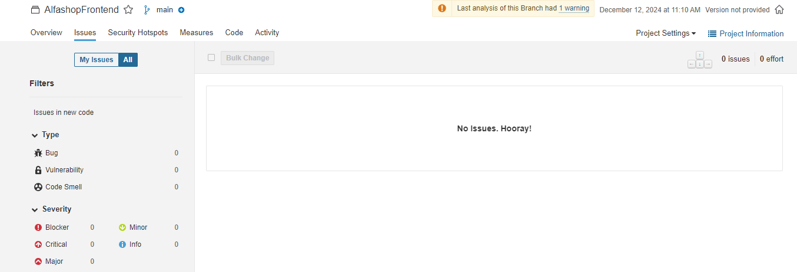

---

### 6. **Construir Imagen Docker Backend**

Construye una imagen Docker para el backend.

```bash
stage('Construir Imagen Docker Backend') {
    steps {
        script {
            dir('back') {
                bat 'docker build -t alfashop .'
            }
        }
    }
}
```

Resultado
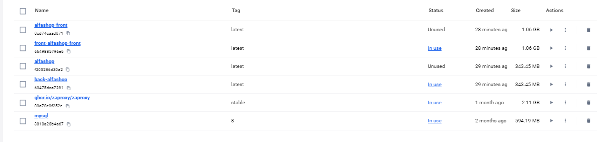

---

### 7. **Levantar Docker Backend**

Levanta los servicios del backend utilizando Docker Compose.

```bash
stage('Levantar Docker') {
    steps {
        script {
            dir('back') {
                bat 'docker-compose up -d'
            }
        }
    }
}
```

Resultado

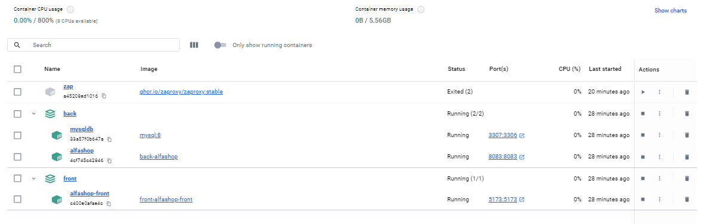

---

### 8. **Construir Imagen Docker Frontend**

Construye una imagen Docker para el frontend.

```bash
stage('Construir Imagen Docker Frontend') {
    steps {
        script {
            dir('front') {
                bat 'docker build -t alfashop-front .'
            }
        }
    }
}
```

Resultado


---

### 9. **Levantar Docker Frontend**

Levanta los servicios del frontend utilizando Docker Compose.

```bash
stage('Levantar Docker Frontend') {
    steps {
        script {
            dir('front') {
                bat 'docker-compose up -d'
            }
        }
    }
}
```

Resultado


---

### 10. **Pruebas Funcionales**

Ejecuta pruebas funcionales utilizando Cypress.

```bash
stage('Pruebas Funcionales') {
    steps {
        script {
            dir('front') {
                bat 'npm run cy:run'
            }
        }
    }
}
```

Resultado pruebas Cypress

Pruebas funcionales:
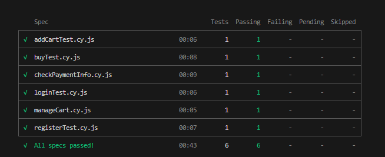
Cobertura de codigo
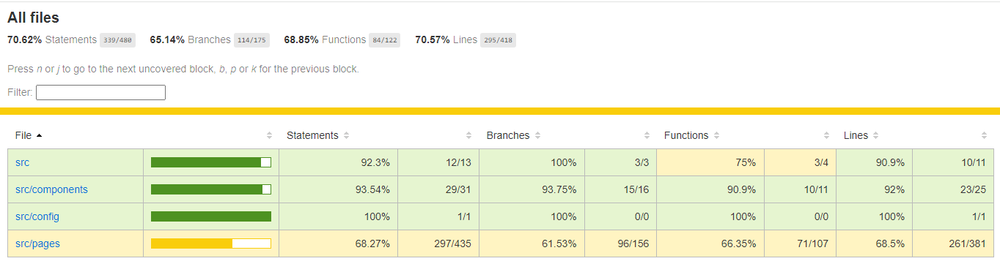

---

### 11. **Pruebas de Rendimiento**

Ejecuta pruebas de rendimiento utilizando JMeter.

```bash
stage('Pruebas de Rendimiento') {
    steps {
        script {
            bat "${JMETER_HOME}/bin/jmeter.bat -n -t PruebasAlfashop.jmx -l results.jtl -e -o report"
        }
    }
}
```

Resultado:
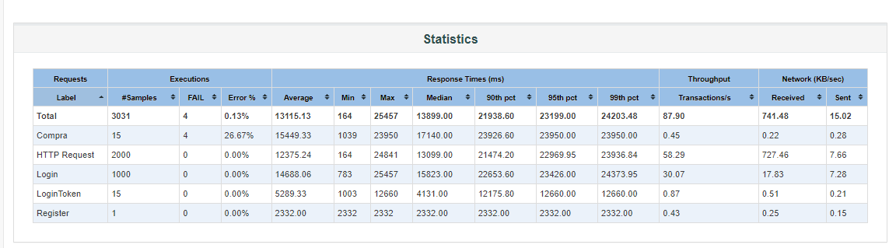
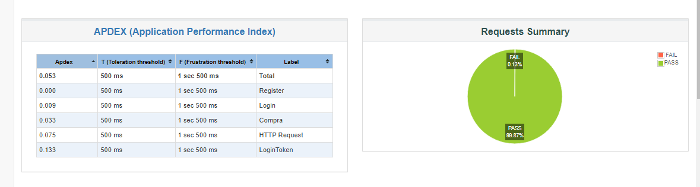

---

### 12. **Pruebas de Seguridad OWASP ZAP**

Ejecuta pruebas de seguridad utilizando OWASP ZAP.

```bash
stage('Ejecutar Pruebas ZAP') {
    steps {
        script {
            bat "docker run -d -u zap --name zap --network host -v ${WORKSPACE}/zap/wrk:/zap/wrk/ -v ${WORKSPACE}/session:/zap/session/ ${ZAP_DOCKER_IMAGE} zap-baseline.py -t http://localhost:5173 -g gen.conf -r /zap/wrk/report.html"
            bat "docker wait zap"
        }
    }
}
```

Resultado:
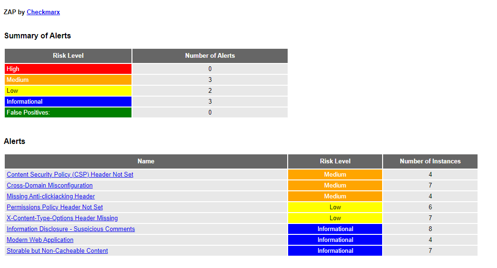

---

## 🟢 **Post Ejecución**

- **Éxito**: Muestra un mensaje indicando que el proceso fue completado exitosamente.

```bash
success {
    echo 'Proceso completado con éxito!'
}
```

- **Fallo**: Muestra un mensaje indicando que hubo un error en el proceso.

```bash
failure {
    echo 'Hubo un error en el proceso.'
}
```
